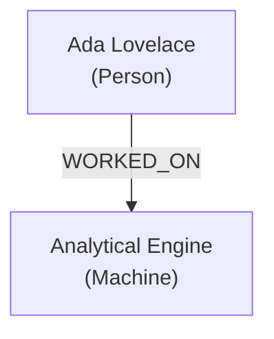

# ACE Knowledge Graph Skill

A complete pipeline for turning any information source into a structured, queryable, visualizable knowledge graph — and reasoning over it.

---

## 1. Understand the Request

Before doing anything, identify:

| Question | Why It Matters |
|---|---|
| **What is the source?** | Text, CSV, JSON, code, PDF, a list of facts, or existing graph data |
| **What is the domain?** | Science, software, business, history, people, concepts, etc. |
| **What is the goal?** | Explore connections, find paths, answer questions, visualize, export |
| **What scale?** | < 50 nodes (in-memory), 50–500 nodes (embedded graph), 500+ (chunked or streamed) |
| **What output?** | Interactive HTML, static SVG, JSON export, Mermaid diagram, text summary, or queryable data structure |

If the user has not specified, **infer from context** and state your assumptions before proceeding.

---

## 2. Extraction Phase

### 2A. Entity Extraction

For each source, extract **entities** — the things the graph is about.

Entities have:
- `id`: unique slug (`person_ada_lovelace`, `concept_backpropagation`)
- `label`: human-readable name
- `type`: category (`Person`, `Concept`, `Event`, `Place`, `Technology`, `Document`, `Organization`, etc.)
- `properties`: key-value metadata (dates, descriptions, aliases, source references)

**Extraction strategies by source type:**

| Source | Strategy |
|---|---|
| **Free text** | NLP-style pass: identify named entities, noun phrases, domain terms |
| **Bullet list / notes** | Each item = potential node; nested items = hierarchical edges |
| **CSV / table** | Each row = entity; columns = properties; foreign keys = edges |
| **JSON** | Traverse structure; objects = nodes; arrays of objects = typed collections |
| **Code** | Functions, classes, modules, imports, call sites = nodes; calls/inheritance = edges |
| **Research paper** | Authors, institutions, methods, datasets, citations, claims = nodes |

### 2B. Relationship Extraction

Relationships are **directed edges** between entities:

```
(source_id) --[relation_type]--> (target_id)
```

Each edge has:
- `source`: entity id
- `target`: entity id
- `relation`: verb phrase or label (`CREATED_BY`, `DEPENDS_ON`, `CAUSES`, `IS_A`, `PART_OF`, `CITED_BY`, `COLLABORATED_WITH`, `CONTRADICTS`, `DEFINED_IN`, etc.)
- `weight` (optional): confidence or frequency (0.0–1.0)
- `properties` (optional): date, context, source citation

**Common relation archetypes:**

| Archetype | Examples |
|---|---|
| Hierarchical | `IS_A`, `PART_OF`, `SUBCLASS_OF`, `CONTAINS` |
| Causal | `CAUSES`, `ENABLES`, `PREVENTS`, `INFLUENCES` |
| Temporal | `PRECEDES`, `FOLLOWS`, `CO-OCCURS_WITH` |
| Associative | `RELATED_TO`, `SIMILAR_TO`, `CONTRASTS_WITH` |
| Attributive | `HAS_PROPERTY`, `DEFINED_AS`, `MEASURED_BY` |
| Provenance | `CREATED_BY`, `PUBLISHED_IN`, `CITED_BY`, `DERIVED_FROM` |
| Functional | `CALLS`, `IMPORTS`, `IMPLEMENTS`, `OVERRIDES` |

---

## 3. Graph Construction

### 3A. In-Memory Representation (Python)

For small to medium graphs, build using `networkx`:

```python
import networkx as nx
import json

G = nx.DiGraph()  # Use nx.Graph() for undirected

# Add nodes
G.add_node("ada_lovelace", label="Ada Lovelace", type="Person",
           description="First computer programmer")

# Add edges
G.add_edge("ada_lovelace", "analytical_engine",
           relation="WORKED_ON", weight=0.95)

# Serialize
data = nx.node_link_data(G)
with open("knowledge_graph.json", "w") as f:
    json.dump(data, f, indent=2)
```

Install: `pip install networkx --break-system-packages`

### 3B. JSON Graph Format (portable, universal)

Always serialize to this canonical format for portability:

```json
{
  "metadata": {
    "title": "My Knowledge Graph",
    "domain": "Computer Science History",
    "created": "2026-03-11",
    "node_count": 0,
    "edge_count": 0
  },
  "nodes": [
    {
      "id": "ada_lovelace",
      "label": "Ada Lovelace",
      "type": "Person",
      "properties": {
        "born": 1815,
        "description": "Mathematician, first programmer"
      }
    }
  ],
  "edges": [
    {
      "source": "ada_lovelace",
      "target": "analytical_engine",
      "relation": "WORKED_ON",
      "weight": 0.95,
      "properties": {}
    }
  ]
}
```

### 3C. Mermaid Diagram (quick rendering)

For graphs under ~25 nodes, output Mermaid syntax for instant rendering:



Use `graph LR` for left-to-right (better for hierarchies), `graph TD` for top-down (better for trees).

---

## 4. Querying & Reasoning

Once the graph is built, answer questions using these patterns:

### 4A. Path Finding
> "How is X connected to Y?"

```python
path = nx.shortest_path(G, source="x_id", target="y_id")
# Return list of node ids + edges traversed
```

Explain the path in natural language:
> "Ada Lovelace → WORKED_ON → Analytical Engine → DESIGNED_BY → Charles Babbage"

### 4B. Neighborhood Exploration
> "What is directly connected to X?"

```python
predecessors = list(G.predecessors("x_id"))
successors = list(G.successors("x_id"))
```

### 4C. Centrality Analysis
> "What are the most important/connected nodes?"

```python
centrality = nx.degree_centrality(G)
betweenness = nx.betweenness_centrality(G)
pagerank = nx.pagerank(G)
top_nodes = sorted(pagerank.items(), key=lambda x: x[1], reverse=True)[:10]
```

### 4D. Community Detection / Clustering
> "What groups or clusters exist?"

```python
import networkx.algorithms.community as nx_comm
communities = nx_comm.greedy_modularity_communities(G.to_undirected())
```

### 4E. Typed Subgraph Queries
> "Show me only the relationships between People and Organizations"

```python
subgraph_nodes = [n for n, d in G.nodes(data=True)
                  if d.get("type") in ("Person", "Organization")]
SG = G.subgraph(subgraph_nodes)
```

### 4F. Natural Language Query Answering
For open-ended questions over the graph, build a context string and reason over it:

1. Extract relevant subgraph (1–2 hops from relevant nodes)
2. Serialize to readable triples: `(Subject) --[RELATION]--> (Object)`
3. Present triples as context + answer the question

---

## 5. Visualization

### 5A. Interactive HTML (recommended for sharing)

Use `pyvis` for interactive HTML output:

```python
from pyvis.network import Network
import networkx as nx

net = Network(height="750px", width="100%", directed=True,
              bgcolor="#1a1a2e", font_color="white")

# Color by node type
type_colors = {
    "Person": "#e94560",
    "Concept": "#0f3460",
    "Event": "#533483",
    "Technology": "#00b4d8",
    "Organization": "#f77f00"
}

for node_id, data in G.nodes(data=True):
    color = type_colors.get(data.get("type", ""), "#888888")
    net.add_node(node_id, label=data.get("label", node_id),
                 color=color, title=data.get("description", ""))

for src, tgt, data in G.edges(data=True):
    net.add_edge(src, tgt, label=data.get("relation", ""),
                 width=data.get("weight", 0.5) * 3)

net.set_options("""
{
  "physics": { "enabled": true, "solver": "forceAtlas2Based" },
  "interaction": { "hover": true, "navigationButtons": true }
}
""")
net.write_html("knowledge_graph.html")
```

Install: `pip install pyvis --break-system-packages`

### 5B. Static SVG / PNG (for documents)

```python
import matplotlib.pyplot as plt

pos = nx.spring_layout(G, seed=42, k=2)
node_colors = [type_colors.get(G.nodes[n].get("type",""), "#888") for n in G.nodes]
labels = {n: G.nodes[n].get("label", n) for n in G.nodes}
edge_labels = {(u,v): d.get("relation","") for u,v,d in G.edges(data=True)}

plt.figure(figsize=(16, 12), facecolor="#1a1a2e")
nx.draw_networkx(G, pos, labels=labels, node_color=node_colors,
                 node_size=1500, font_size=8, font_color="white",
                 edge_color="#ffffff44", arrows=True, arrowsize=15)
nx.draw_networkx_edge_labels(G, pos, edge_labels=edge_labels,
                              font_size=6, font_color="#aaaaaa")
plt.savefig("knowledge_graph.png", dpi=150, bbox_inches="tight",
            facecolor="#1a1a2e")
```

Install: `pip install matplotlib --break-system-packages`

### 5C. React Artifact (for Claude.ai interactive display)

For in-chat visualization, generate a React artifact using D3 force-directed graph or a custom SVG layout. See **Section 7: Artifact Template** below.

---

## 6. Enrichment & Quality

After initial construction, improve graph quality:

### 6A. Deduplication
- Merge nodes with same label but different IDs
- Check for alias entities (e.g., "ML" and "Machine Learning")
- Normalize IDs to snake_case slugs

### 6B. Completeness Check
- Identify "orphan nodes" (no edges) — are they missing connections?
- Identify "hub overload" (one node with 50+ edges) — should it be split?
- Check for missing inverses (`A CAUSES B` but no `B CAUSED_BY A`)

### 6C. Confidence Scoring
Rate each extracted entity and edge:
- **High (0.9–1.0)**: Explicitly stated in source
- **Medium (0.6–0.8)**: Inferred from context
- **Low (0.3–0.5)**: Speculative or uncertain
- Flag low-confidence edges for human review

### 6D. Schema Validation
Enforce domain-specific constraints:
```python
VALID_NODE_TYPES = {"Person", "Concept", "Event", "Place", "Technology", "Document", "Organization"}
VALID_RELATIONS = {"IS_A", "PART_OF", "CREATED_BY", "RELATED_TO", "CAUSES", "DEPENDS_ON", ...}

for node_id, data in G.nodes(data=True):
    assert data.get("type") in VALID_NODE_TYPES, f"Invalid type for {node_id}"
```

---

## 7. React Artifact Template

When rendering a knowledge graph as an interactive artifact in Claude.ai:

```jsx
import { useState, useEffect, useRef } from "react";

const GRAPH_DATA = {
  nodes: [ /* ... */ ],
  edges: [ /* ... */ ]
};

const TYPE_COLORS = {
  Person: "#e94560",
  Concept: "#0f3460",
  Technology: "#00b4d8",
  Event: "#533483",
  Organization: "#f77f00",
  default: "#888888"
};

export default function KnowledgeGraph() {
  const [selected, setSelected] = useState(null);
  const [filter, setFilter] = useState("All");
  const svgRef = useRef(null);

  const types = ["All", ...new Set(GRAPH_DATA.nodes.map(n => n.type))];
  const visibleNodes = filter === "All"
    ? GRAPH_DATA.nodes
    : GRAPH_DATA.nodes.filter(n => n.type === filter);
  const visibleIds = new Set(visibleNodes.map(n => n.id));
  const visibleEdges = GRAPH_DATA.edges.filter(
    e => visibleIds.has(e.source) && visibleIds.has(e.target)
  );

  // Simple force-layout positions (replace with D3 for dynamic)
  // For static graphs, pre-compute positions

  return (
    <div style={{ background: "#0d1117", minHeight: "100vh", padding: 20, color: "white" }}>
      <h1 style={{ fontFamily: "monospace", color: "#58a6ff" }}>Knowledge Graph</h1>

      {/* Filter bar */}
      <div style={{ display: "flex", gap: 8, marginBottom: 16 }}>
        {types.map(t => (
          <button key={t} onClick={() => setFilter(t)}
            style={{
              padding: "4px 12px", borderRadius: 20, border: "none", cursor: "pointer",
              background: filter === t ? TYPE_COLORS[t] || "#58a6ff" : "#21262d",
              color: "white", fontSize: 12
            }}>
            {t}
          </button>
        ))}
      </div>

      {/* Graph SVG */}
      <svg ref={svgRef} width="100%" height={500}
           style={{ background: "#161b22", borderRadius: 12, border: "1px solid #30363d" }}>
        {/* Edges */}
        {visibleEdges.map((e, i) => (
          <g key={i}>
            {/* Draw line from source to target — requires position lookup */}
            <text fontSize={9} fill="#8b949e">{e.relation}</text>
          </g>
        ))}
        {/* Nodes */}
        {visibleNodes.map((n) => (
          <g key={n.id} onClick={() => setSelected(n)} style={{ cursor: "pointer" }}>
            <circle r={20} fill={TYPE_COLORS[n.type] || TYPE_COLORS.default} opacity={0.9} />
            <text textAnchor="middle" dy={4} fontSize={9} fill="white">{n.label}</text>
          </g>
        ))}
      </svg>

      {/* Detail panel */}
      {selected && (
        <div style={{ marginTop: 16, padding: 16, background: "#161b22",
                      borderRadius: 8, border: `2px solid ${TYPE_COLORS[selected.type] || "#888"}` }}>
          <h3 style={{ margin: 0, color: TYPE_COLORS[selected.type] }}>{selected.label}</h3>
          <p style={{ color: "#8b949e", fontSize: 13 }}>{selected.type}</p>
          {selected.description && <p style={{ fontSize: 13 }}>{selected.description}</p>}
          <h4 style={{ fontSize: 12, color: "#8b949e" }}>Connections:</h4>
          {GRAPH_DATA.edges
            .filter(e => e.source === selected.id || e.target === selected.id)
            .map((e, i) => (
              <div key={i} style={{ fontSize: 12, color: "#c9d1d9", margin: "2px 0" }}>
                {e.source === selected.id
                  ? `→ [${e.relation}] → ${e.target}`
                  : `← [${e.relation}] ← ${e.source}`}
              </div>
            ))}
        </div>
      )}
    </div>
  );
}
```

> **Note**: For fully dynamic force-directed layout, import D3 in the artifact:
> `import * as d3 from 'd3'` and use `d3.forceSimulation()`.

---

## 8. Output Checklist

Before delivering results, verify:

- [ ] All entities have unique IDs, labels, and types
- [ ] All edges have source, target, and a meaningful relation label
- [ ] No orphaned nodes (unless intentional)
- [ ] JSON export is valid and self-contained
- [ ] Visualization renders without overlap for graphs < 50 nodes
- [ ] Any inferred relationships are flagged as such
- [ ] The user's original question is answered using the graph

---

## 9. Common Patterns & Recipes

| User Says | Pattern to Apply |
|---|---|
| "Map how these concepts relate" | Extract concept nodes → infer semantic edges → render Mermaid or React artifact |
| "Build a dependency graph for my code" | Parse imports/calls → create module/function nodes → directed `CALLS`/`IMPORTS` edges |
| "Who knows who in this dataset" | Person nodes → `KNOWS`/`WORKS_WITH` edges → community detection |
| "Turn my notes into a knowledge base" | Chunk notes → extract entities per chunk → merge duplicates → queryable graph |
| "Find the path between X and Y" | Build graph → `nx.shortest_path()` → explain path in prose |
| "What are the central ideas?" | Build graph → `nx.pagerank()` → return top 10 nodes with context |
| "Show clusters / themes" | Build graph → `greedy_modularity_communities()` → label and color each community |
| "Export this for Neo4j / Gephi" | Serialize to Cypher statements or GEXF format |

### Neo4j Cypher Export:
```python
for node_id, data in G.nodes(data=True):
    props = ", ".join(f'{k}: "{v}"' for k, v in data.items())
    print(f'CREATE (:{data["type"]} {{id: "{node_id}", {props}}})')

for src, tgt, data in G.edges(data=True):
    print(f'MATCH (a {{id: "{src}"}}), (b {{id: "{tgt}"}}) '
          f'CREATE (a)-[:{data["relation"]}]->(b)')
```

### Gephi GEXF Export:
```python
nx.write_gexf(G, "graph.gexf")
```

---

## 10. Scaling Guidance

| Graph Size | Approach |
|---|---|
| < 50 nodes | Full in-memory, render everything, interactive React/pyvis |
| 50–500 nodes | Filter by type/community before rendering; show top N by centrality |
| 500–5000 nodes | Use chunked extraction; load subgraphs on demand; use Neo4j or DuckDB |
| 5000+ nodes | Dedicated graph DB (Neo4j, TigerGraph); batch processing; embedding-based retrieval |

For large graphs, prioritize:
1. Extract → serialize to JSON → store
2. Query on demand (subgraph + path queries)
3. Visualize subgraphs, not the whole graph

---

## Reference Files (optional bundled resources)

If bundled with this skill:
- `references/ontologies.md` — Common domain ontologies and standard relation vocabularies
- `references/graph_algorithms.md` — Full reference for NetworkX algorithms
- `scripts/extract_entities.py` — Reusable entity extraction helper
- `scripts/build_graph.py` — Graph construction boilerplate
- `scripts/visualize.py` — pyvis + matplotlib visualization helpers
- `assets/color_palettes.json` — Curated color palettes by domain

---

*ACE = Accurate, Connected, Explorable — the three properties every good knowledge graph should have.*
