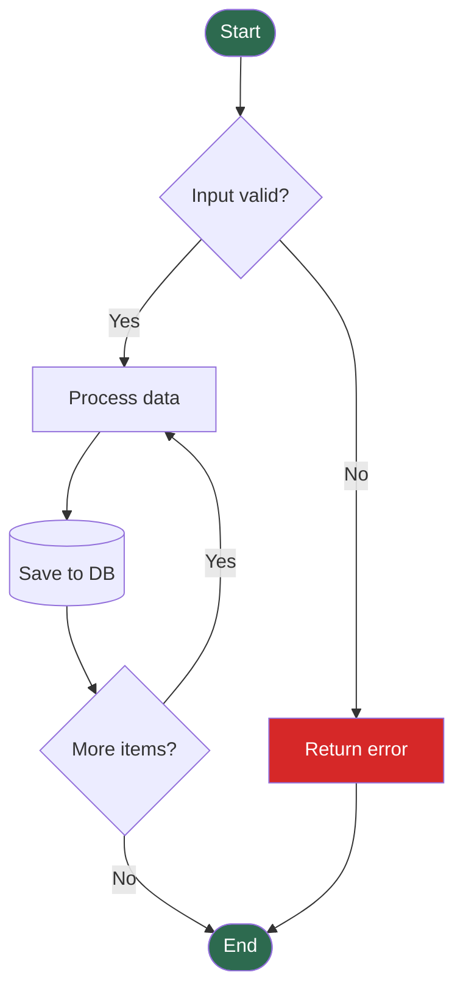
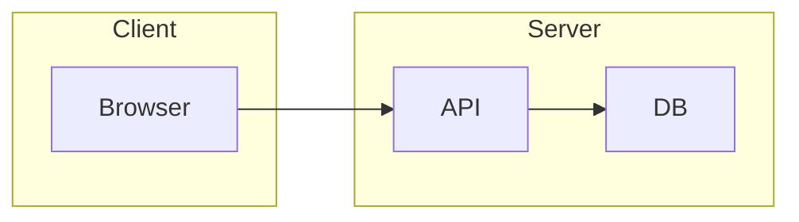
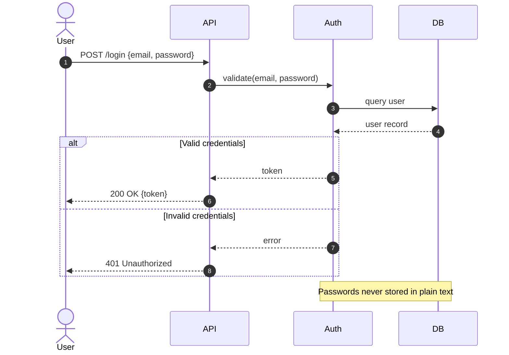
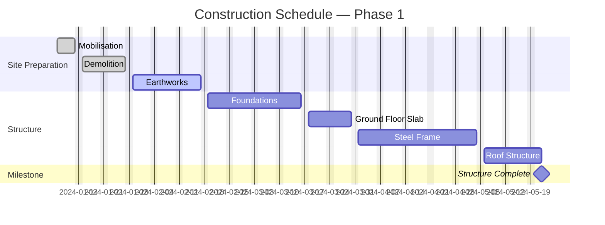
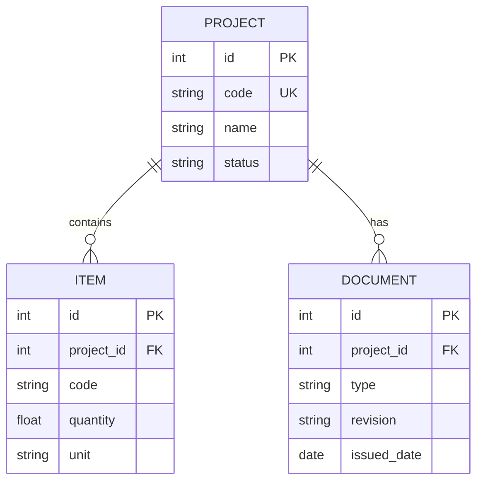
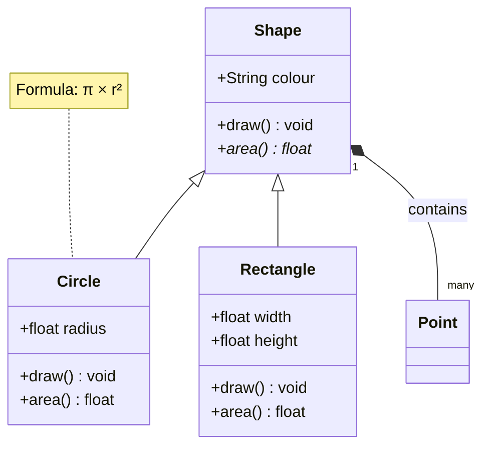
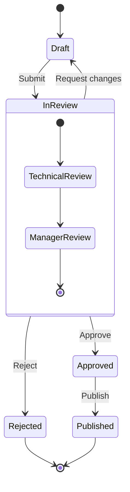

# SKILL_DIAGRAM_MERMAID_AUTOGEN — Mermaid Diagram Skill

## Quick Reference

| Diagram Type | Syntax Keyword | Section |
|-------------|---------------|---------|
| Flowchart | `flowchart TD` | [Flowchart](#flowchart) |
| Sequence | `sequenceDiagram` | [Sequence Diagram](#sequence-diagram) |
| Gantt | `gantt` | [Gantt Chart](#gantt-chart) |
| Entity-Relationship | `erDiagram` | [ER Diagram](#er-diagram) |
| Class | `classDiagram` | [Class Diagram](#class-diagram) |
| State | `stateDiagram-v2` | [State Diagram](#state-diagram) |
| Render & export | [Rendering & Export](#rendering--export) |
| Validation & QA | [Validation & QA](#validation--qa) |

---

## Flowchart



### Node Shapes

```
A[Rectangle]
B(Rounded)
C([Stadium / Pill])
D[[Subroutine]]
E[(Database / Cylinder)]
F((Circle))
G>Asymmetric]
H{Diamond / Decision}
I{{Hexagon}}
J[/Parallelogram/]
K[\Parallelogram alt\]
L[/Trapezoid\]
```

### Edge Types

```
A --> B         arrow
A --- B         open line
A -.-> B        dotted arrow
A ==> B         thick arrow
A --text--> B   labelled arrow
A -- text --- B labelled line
A ~~~B          invisible (layout only)
```

### Direction

```
TD  — Top to Down
LR  — Left to Right
BT  — Bottom to Top
RL  — Right to Left
```

### Subgraphs



---

## Sequence Diagram



### Sequence Syntax

```
->>     solid arrow (sync)
-->>    dashed arrow (return)
-x      async with X at end
-)      async open arrow
+       activate lifeline
-       deactivate lifeline

activate API
deactivate API

loop Every 5 minutes
    ...
end

alt Condition A
    ...
else Condition B
    ...
end

opt Optional block
    ...
end

par Parallel
    ...
and
    ...
end
```

---

## Gantt Chart



### Gantt Syntax

```
dateFormat YYYY-MM-DD     date input format
axisFormat %d %b          axis display format (%Y, %m, %d, %b)
excludes weekends         or: excludes 2024-01-01,2024-04-19

section Name              groups tasks visually

Task name : [tags,] [id,] startDate, duration
Task name : [tags,] [id,] after id,  duration

Tags: done | active | crit | milestone
id:   alphanumeric identifier for after-references
Duration: 1d | 1w | 1h | YYYY-MM-DD (end date)
```

---

## ER Diagram



### Cardinality Notation

```
|o  — zero or one
||  — exactly one
}o  — zero or many
}|  — one or many
```

---

## Class Diagram



---

## State Diagram



---

## Rendering & Export

### Render to Image (CLI)

```bash
# Install Mermaid CLI
npm install -g @mermaid-js/mermaid-cli

# Render to PNG
mmdc -i diagram.mmd -o diagram.png

# Render to SVG (scalable — preferred)
mmdc -i diagram.mmd -o diagram.svg

# Render to PDF
mmdc -i diagram.mmd -o diagram.pdf

# Custom theme
mmdc -i diagram.mmd -o diagram.png -t dark
mmdc -i diagram.mmd -o diagram.png -t forest

# Custom config
mmdc -i diagram.mmd -o diagram.png -c config.json
```

```json
// config.json
{
  "theme": "default",
  "themeVariables": {
    "primaryColor": "#1a6b4a",
    "primaryTextColor": "#ffffff",
    "lineColor": "#333333"
  }
}
```

### Render from Python

```python
import subprocess
from pathlib import Path

def render_mermaid(mmd_content: str, output_path: str,
                   format: str = "svg") -> bool:
    """Render Mermaid diagram to image file."""
    tmp = Path("/tmp/diagram.mmd")
    tmp.write_text(mmd_content, encoding="utf-8")

    result = subprocess.run(
        ["mmdc", "-i", str(tmp), "-o", output_path],
        capture_output=True, text=True
    )

    if result.returncode != 0:
        print(f"Render error: {result.stderr}")
        return False

    print(f"Rendered: {output_path}")
    return True


diagram = """
flowchart LR
    A --> B --> C
"""
render_mermaid(diagram, "output.svg")
```

### Embed in Markdown

````markdown

````

Renders natively in: GitHub, GitLab, Notion, Obsidian, VS Code (with extension), MkDocs (with plugin).

---

## Validation & QA

```bash
# Validate without rendering
mmdc -i diagram.mmd -o /dev/null && echo "VALID"

# Validate all .mmd files in project
find . -name "*.mmd" -exec mmdc -i {} -o /dev/null \;
```

```python
import subprocess
from pathlib import Path

def validate_mermaid(mmd_content: str) -> bool:
    """Parse-validate Mermaid diagram syntax."""
    tmp = Path("/tmp/validate_diagram.mmd")
    tmp.write_text(mmd_content, encoding="utf-8")

    result = subprocess.run(
        ["mmdc", "-i", str(tmp), "-o", "/dev/null"],
        capture_output=True, text=True
    )

    if result.returncode != 0:
        print(f"INVALID: {result.stderr.strip()}")
        return False

    print("VALID: Diagram parsed successfully")
    return True
```

### QA Checklist

- [ ] Diagram type keyword is correct (e.g. `flowchart`, not `graph`)
- [ ] Node IDs are unique within diagram
- [ ] No unsupported characters in node labels (use quotes for special chars)
- [ ] `mmdc` renders without error
- [ ] Rendered output reviewed visually — layout is logical
- [ ] Long labels use line breaks (`<br/>`) if needed
- [ ] Gantt dates are chronologically sensible
- [ ] Direction (`TD`/`LR`) matches the logical flow

### QA Loop

1. Write Mermaid code
2. `mmdc -i diagram.mmd -o /dev/null` — syntax check
3. Render to SVG: `mmdc -i diagram.mmd -o diagram.svg`
4. Visual review — check layout, labels, arrow directions
5. Embed in target document and verify rendering
6. **Do not publish until visual review passes**

---

## Common Issues & Fixes

| Issue | Cause | Fix |
|-------|-------|-----|
| `Parse error` | Special characters in label | Wrap label in quotes: `A["label: with colon"]` |
| Nodes overlap | Too many nodes in one direction | Switch direction (`TD` ↔ `LR`) or use subgraphs |
| Gantt bar not showing | Wrong date format | Ensure `dateFormat` matches date strings |
| Arrow label not centred | Long label | Use short labels; add `<br/>` for line breaks |
| `after X` not resolving | ID typo | IDs are case-sensitive; verify id matches exactly |
| Mermaid not rendering in GitHub | Syntax error or unsupported feature | Test on mermaid.live first |

---

## Dependencies

```bash
npm install -g @mermaid-js/mermaid-cli   # CLI renderer

# VS Code: install "Mermaid Preview" extension
# Online editor: https://mermaid.live
```
