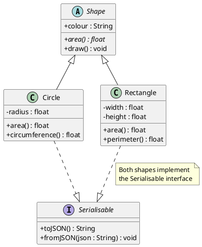
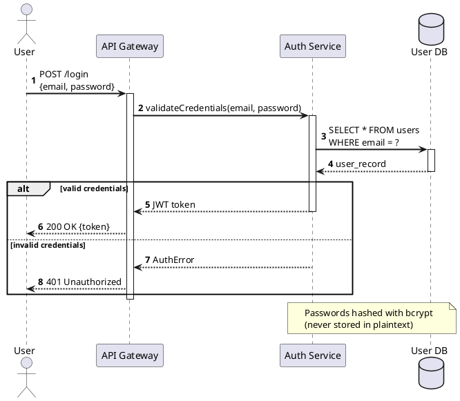
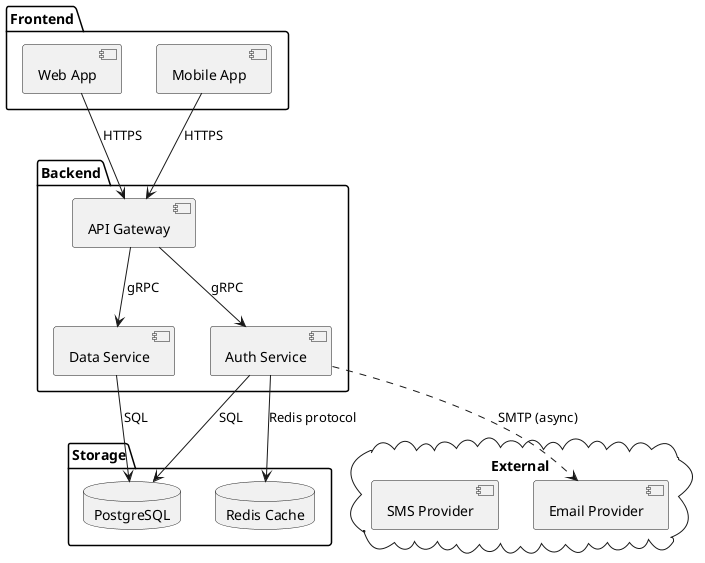
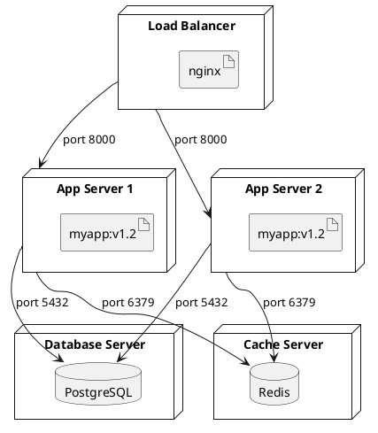
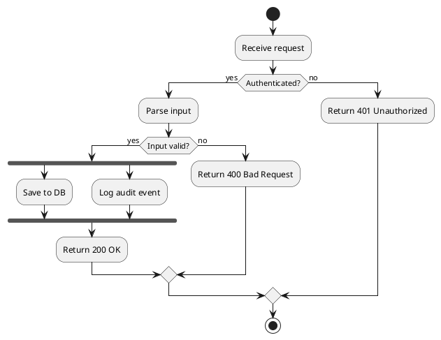

# SKILL_DIAGRAM_PLANTUML_AUTOGEN — PlantUML Diagram Skill

## Quick Reference

| Diagram Type | Section |
|-------------|---------|
| Class diagram | [Class Diagram](#class-diagram) |
| Sequence diagram | [Sequence Diagram](#sequence-diagram) |
| Component / deployment | [Component & Deployment](#component--deployment) |
| Activity / flowchart | [Activity Diagram](#activity-diagram) |
| C4 architecture model | [C4 Model](#c4-model) |
| Render & export | [Rendering & Export](#rendering--export) |
| Validation & QA | [Validation & QA](#validation--qa) |

---

## PlantUML File Structure

```plantuml
@startuml DiagramName

' Comment with single quote
/' Multi-line
   comment '/

skinparam defaultFontName Arial
skinparam backgroundColor #FFFFFF

' ... diagram content ...

@enduml
```

---

## Class Diagram



### Relationships

```plantuml
A <|-- B       ' Inheritance (B extends A)
A <|.. B       ' Realisation (B implements A)
A --> B        ' Association (A has B)
A *-- B        ' Composition (A owns B, B dies with A)
A o-- B        ' Aggregation (A has B, B exists independently)
A ..> B        ' Dependency (A uses B)
A "1" --> "n" B  ' With cardinality labels
```

### Visibility Modifiers

```
+  public
-  private
#  protected
~  package-private
{abstract}  abstract method/class
{static}    static method/field
```

---

## Sequence Diagram



---

## Component & Deployment

### Component Diagram



### Deployment Diagram



---

## Activity Diagram



---

## C4 Model

```plantuml
@startuml C4-ContextDiagram

!include https://raw.githubusercontent.com/plantuml-stdlib/C4-PlantUML/master/C4_Context.puml

LAYOUT_WITH_LEGEND()
title System Context — Project Management Platform

Person(owner,       "Project Owner",   "Manages projects\nand approvals")
Person(contractor,  "Contractor",      "Submits schedules\nand reports")
Person(admin,       "Administrator",   "System configuration")

System(pms, "Project Management\nSystem", "Central platform for\nproject coordination")

System_Ext(email,   "Email Service",   "Sends notifications")
System_Ext(docstore,"Document Store",  "Long-term archive")
System_Ext(erp,     "ERP System",      "Financial data source")

Rel(owner,      pms,     "Reviews and approves")
Rel(contractor, pms,     "Submits deliverables")
Rel(admin,      pms,     "Configures system")
Rel(pms,        email,   "Sends notifications")
Rel(pms,        docstore,"Archives documents")
Rel(pms,        erp,     "Syncs financial data", "REST API")

@enduml
```

---

## Styling & Themes

```plantuml
@startuml StyledDiagram

' Built-in themes
!theme materia
' Other themes: cerulean, cyborg, hacker, lightgray, mars, materia,
'              mimeograph, minty, plain, reddress-darkblue, sandstone,
'              silver, sketchy, sketchy-outline, spacelab, toy, united, vibrant

' Custom skinparam
skinparam {
    defaultFontName     "Arial"
    defaultFontSize     12
    backgroundColor     #FFFFFF
    shadowing           false
    ArrowColor          #333333

    ClassBackgroundColor    #E8F4F8
    ClassBorderColor        #1a6b9a
    ClassHeaderBackgroundColor #1a6b9a
    ClassFontColor          #FFFFFF

    NoteBackgroundColor     #FFF9C4
    NoteBorderColor         #F9A825
}

@enduml
```

---

## Rendering & Export

### CLI (jar-based)

```bash
# Download PlantUML jar
wget https://github.com/plantuml/plantuml/releases/latest/download/plantuml.jar

# Render to PNG (default)
java -jar plantuml.jar diagram.puml

# Render to SVG
java -jar plantuml.jar -tsvg diagram.puml

# Render to PDF
java -jar plantuml.jar -tpdf diagram.puml

# Render all .puml files in directory
java -jar plantuml.jar -tsvg -r ./diagrams/

# Check syntax without rendering
java -jar plantuml.jar -syntax diagram.puml
```

### Python

```python
import subprocess
from pathlib import Path

PLANTUML_JAR = Path("./plantuml.jar")

def render_plantuml(puml_path: str, format: str = "svg") -> bool:
    """Render PlantUML diagram to image."""
    result = subprocess.run(
        ["java", "-jar", str(PLANTUML_JAR), f"-t{format}", puml_path],
        capture_output=True, text=True
    )
    if result.returncode != 0:
        print(f"Error: {result.stderr}")
        return False
    output = Path(puml_path).with_suffix(f".{format}")
    print(f"Rendered: {output}")
    return True

def validate_plantuml(puml_content: str) -> bool:
    """Validate PlantUML syntax without rendering."""
    tmp = Path("/tmp/validate.puml")
    tmp.write_text(puml_content, encoding="utf-8")
    result = subprocess.run(
        ["java", "-jar", str(PLANTUML_JAR), "-syntax", str(tmp)],
        capture_output=True, text=True
    )
    output = result.stdout + result.stderr
    if "ERROR" in output.upper() or result.returncode != 0:
        print(f"INVALID:\n{output}")
        return False
    print("VALID")
    return True
```

### VS Code / IDE

```
VS Code extension: "PlantUML" by jebbs
  - Preview: Alt+D
  - Export: Right-click → Export Current Diagram

IntelliJ IDEA: built-in PlantUML support with preview
```

---

## Validation & QA

```bash
# Syntax check
java -jar plantuml.jar -syntax diagram.puml
# Pass: No syntax error

# Render and verify output file exists
java -jar plantuml.jar -tsvg diagram.puml && ls -lh diagram.svg
```

### QA Checklist

- [ ] File starts with `@startuml` and ends with `@enduml`
- [ ] Diagram name in `@startuml Name` is alphanumeric (no spaces)
- [ ] Syntax check passes with no errors
- [ ] Rendered output reviewed visually
- [ ] Relationships use correct arrow types for diagram type
- [ ] `skinparam` applied consistently
- [ ] Labels are concise (no wall-of-text nodes)
- [ ] C4 diagrams include correct level (Context/Container/Component)

### QA Loop

1. Write diagram
2. `java -jar plantuml.jar -syntax diagram.puml` — check syntax
3. Render to SVG
4. Visual review — readability, layout, arrow directions
5. **Do not publish until visual review passes**

---

## Common Issues & Fixes

| Issue | Cause | Fix |
|-------|-------|-----|
| `Cannot find Graphviz` | Graphviz not installed | `sudo apt install graphviz` |
| `ERROR: Syntax error` | Typo or unsupported syntax | Use `-syntax` flag to locate error line |
| Diagram renders blank | Empty body between `@startuml` / `@enduml` | Add content; check `@` tags are on own lines |
| Actors overlap | Too many elements in sequence | Use `box` grouping or split into sub-diagrams |
| Fonts look wrong | Default font missing | Set `skinparam defaultFontName Arial` |
| C4 includes fail | Network unreachable | Download C4 stdlib locally; use local `!include` |

---

## Dependencies

```bash
# Java (required)
sudo apt install default-jre

# Graphviz (required for most diagram types)
sudo apt install graphviz
brew install graphviz          # macOS

# PlantUML jar
wget https://github.com/plantuml/plantuml/releases/latest/download/plantuml.jar

# VS Code extension
code --install-extension jebbs.plantuml

# Python subprocess — stdlib only
import subprocess
```
